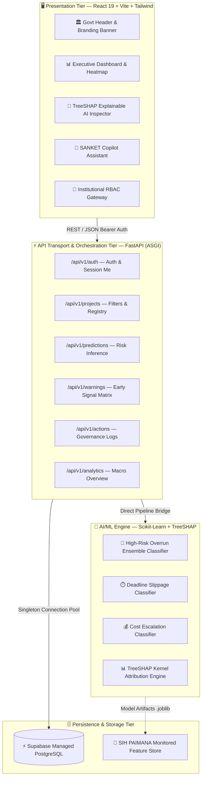
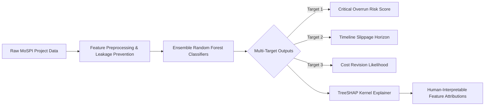

<div align="center">

<!-- SANKET-AI ANIMATED HEADER BANNER -->


<br/>

<!-- INSTITUTIONAL BADGES -->
[](https://www.mospi.gov.in/)
[](https://www.sih.gov.in/)
[](https://www.sih.gov.in/)

<br/>

<!-- TECH & CODE STATUS BADGES -->
[](https://fastapi.tiangolo.com/)
[](https://react.dev/)
[](https://www.typescriptlang.org/)
[](https://vitejs.dev/)
[](https://tailwindcss.com/)
[](https://www.python.org/)
[](https://scikit-learn.org/)
[](https://shap.readthedocs.io/)
[](https://supabase.com/)
[](LICENSE)

<br/>

<p align="center">
  <b>🇮🇳 National Sovereign Decision-Support System for Mega Infrastructure Project Monitoring & Pre-Emptive Risk Mitigation 🇮🇳</b>
</p>

<p align="center">
  <a href="#-executive-summary">Executive Summary</a> •
  <a href="#-key-features--capabilities">Key Capabilities</a> •
  <a href="#-system-architecture">System Architecture</a> •
  <a href="#-ai--explainability-engine-xai">AI & XAI Engine</a> •
  <a href="#-user-portals--role-based-workflows">User Portals</a> •
  <a href="#-repository-structure">Repo Layout</a> •
  <a href="#-quickstart-guide">Quickstart</a> •
  <a href="#-team-falcon001">Team Falcon001</a>
</p>

---

</div>

## 📌 Executive Summary

**SANKET-AI** is a next-generation, institutionally hardened **Infrastructure Intelligence & Predictive Governance Platform** conceptualized and developed for the **Ministry of Statistics and Programme Implementation (MoSPI)**, Government of India.

Central sector infrastructure projects often encounter unforeseen bottlenecks, structural cost overruns, and cascading milestone slippages. **SANKET-AI** transforms reactive project audits into **proactive, data-driven intelligence** by synthesizing multi-snapshot historical project data (`SIH_PAIMANA`), computing dynamic financial/physical velocities, and leveraging **TreeSHAP-powered Machine Learning ensemble models** to deliver actionable early warnings directly to policymakers, project review directors, and administrative heads.

```
       ┌────────────────────────────────────────────────────────────────────────┐
       │                       🏛️ MoSPI SANKET-AI MISSION                       │
       ├────────────────────────────────────────────────────────────────────────┤
       │  🚀 Real-time Velocity Auditing      🔍 Explainable AI (TreeSHAP)      │
       │  💰 Multi-Target Risk Forecasting   📊 Geospatial State Intelligence  │
       │  🛡️ Triple-Tier Role RBAC           ⚡ Automated Early Warning Matrix │
       └────────────────────────────────────────────────────────────────────────┘
```

---

## 🎖️ Team Falcon001 &nbsp; 

<div align="center">

```
   ███████╗ █████╗ ██╗      ██████╗ ██████╗ ███╗   ██╗ ██████╗  ██████╗  ██╗
   ██╔════╝██╔══██╗██║     ██╔════╝██╔═══██╗████╗  ██║██╔═████╗██╔═████╗███║
   █████╗  ███████║██║     ██║     ██║   ██║██╔██╗ ██║██║██╔██║██║██╔██║╚██║
   ██╔══╝  ██╔══██║██║     ██║     ██║   ██║██║╚██╗██║████╔╝██║████╔╝██║ ██║
   ██║     ██║  ██║███████╗╚██████╗╚██████╔╝██║ ╚████║╚██████╔╝╚██████╔╝ ██║
   ╚═╝     ╚═╝  ╚═╝╚══════╝ ╚═════╝ ╚═════╝ ╚═╝  ╚═══╝ ╚═════╝  ╚═════╝  ╚═╝
```

| Role | Name / Designation | GitHub Profile |
| :--- | :--- | :--- |
| 👑 **Team Leader** | **Charitarth Zinzuwadiya** | [charitarthz](https://github.com/charitarthz) |
| 🧑‍💻 **Team Member** | **Abhay Jagatiya** | [Abhay](https://github.com/AbhayJagatiya) |
| 🧑‍💻 **Team Member** | **Vansh Ghanchi**| [Vansh](https://github.com/Vansh-Ghanchi) |
| 🧑‍💻 **Team Member** | **Nandani Solgama** | [Nandani]((https://github.com/NandaniJS08)) |
| 🧑‍💻 **Team Member** | | [@member5](https://github.com/) |
| 🧑‍💻 **Team Member** | | [@member6](https://github.com/) |

</div>

---

## ✨ Key Features & Capabilities

```
┌────────────────────────────────────────────────────────────────────────────────────────┐
│                                 CORE SYSTEM HIGHLIGHTS                                 │
└────────────────────────────────────────────────────────────────────────────────────────┘
  ├── 🎯 Multi-Target Risk Prediction
  │   ├── High Overrun Vulnerability Score (Ensemble Classifier)
  │   ├── Commissioning Deadline Slip Horizon (Date of Completion drift)
  │   └── Capital Cost Escalation Probability (Burn vs Physical Progress)
  │
  ├── 🔬 Explainable AI (TreeSHAP XAI)
  │   ├── Global Feature Importance Spectrum
  │   ├── Local Waterfall / Force Feature Attributions for each Project
  │   └── Zero-Blackbox Regulatory Transparency (Plain-English driver tags)
  │
  ├── 🗺️ Interactive Geospatial Intelligence
  │   ├── Dynamic SVG India State Heatmaps (Live State Risk Aggregations)
  │   ├── Sectoral Drilldowns (Roads, Railways, Power, Petroleum, Urban)
  │   └── High-Density Priority Watchlist for fast executive sorting
  │
  ├── 🛡️ Institutional Role-Based Access Control (RBAC)
  │   ├── 🏛️ Policymaker (Macro analytics, budget oversight, high-level KPIs)
  │   ├── 🔍 Reviewer / Monitoring Officer (Audit drilldowns, XAI explanations)
  │   └── ⚙️ Administrator (System telemetry, action logs, governance dispatch)
  │
  └── 🤖 SANKET Copilot (Intelligent AI Assistant)
      ├── Context-aware natural language query engine on infrastructure health
      └── Instant summarization of project bottlenecks & mitigation playbooks
```

---

## 🏛️ System Architecture

SANKET-AI is engineered with a **clean three-tier modular monolith architecture**, ensuring enterprise-grade scalability, non-blocking asynchronous I/O, and decoupled AI computation.



---

## 🔬 AI & Explainability Engine (XAI)

Traditional black-box machine learning models fail statutory governance standards. **SANKET-AI enforces complete transparency through TreeSHAP (SHapley Additive exPlanations)**:

### 26-Dimensional Engineered Feature Matrix

```
       Financial Indicators               Physical Indicators              Velocity Indicators
  ┌─────────────────────────────┐    ┌─────────────────────────────┐    ┌─────────────────────────────┐
  │ • Sanctioned Capital Outlay │    │ • Cumulative Progress %     │    │ • 3-Month Progress Velocity │
  │ • Capital Burn Ratio        │    │ • Milestone Stagnation Flag │    │ • 3-Month Spend Velocity    │
  │ • Cost Revision Count       │    │ • Progress vs Benchmark     │    │ • 3-Month Cost Drift Rate   │
  │ • Cost Escalation Rate      │    │ • Time Slippage (Months)    │    │ • Target Date Push Shift    │
  └─────────────────────────────┘    └─────────────────────────────┘    └─────────────────────────────┘
```

### Risk Stratification Pipeline



---

## 🎨 Theme & Institutional UI Aesthetics

The user interface follows the official **MoSPI / Government of India Design System (Sovereign Teal & Indian Saffron)**:

<div align="center">

| Color Palette Token | Hex Code | Visual Swatch | Institutional Usage |
| :--- | :--- | :---: | :--- |
| **National Deep Navy** | `#031e2d` | `■` | Primary Background, Structural Containers |
| **Govt Slate Blue** | `#0a3c58` | `■` | Cards, Panels, Navigation Headers |
| **Saffron Highlight** | `#F27F0C` | `■` | Key Action Triggers, Warning Accents, Highlights |
| **Indian Sovereign Green** | `#138808` | `■` | Safe Progress, Verified Badges, Healthy Indicators |
| **Critical Alert Red** | `#EF4444` | `■` | High Risk Escalations, Bottlenecks, Slips |

</div>

---

## 📁 Repository Structure

```text
sih_full_stack/
│
├── 📄 .gitignore                       # Master exclusion rules (secrets, dist, pycache)
├── 📄 README.md                        # Sovereign project documentation & guide
│
├── 🧠 Ai_engine/                       # Machine Learning & Explainable AI Engine
│   ├── models/                         # Serialized Production ML Models (.joblib)
│   ├── models_corrected/               # Calibrated Multi-Target Ensembles
│   ├── models_backup_phase16/          # Historical Versioned Checkpoints
│   ├── requirements.txt                # ML dependencies (scikit-learn, shap, pandas)
│   └── src/
│       ├── predict.py                  # SanketPredictor & TreeSHAP Attribution Logic
│       ├── preprocess.py               # Feature Engineering & GroupSplit Scalers
│       └── train.py                    # Multi-Target Supervised Training Pipeline
│
├── ⚡ backend/                         # FastAPI Microservices Backend
│   ├── app/
│   │   ├── core/                       # App Configuration & Auth Interceptors
│   │   ├── db/                         # Supabase PostgreSQL Database Client
│   │   ├── routes/                     # REST API Routing (Projects, Alerts, XAI, Stats)
│   │   ├── services/                   # Business Logic & Model Orchestration Layer
│   │   └── main.py                     # Application Root & CORS Middleware
│   ├── .env.example                    # Template environment variables
│   ├── requirements.txt                # FastAPI, Uvicorn, Pydantic dependencies
│   ├── run.py                          # Local ASGI launcher (port 8000)
│   └── README.md                       # Backend specific documentation
│
└── 🖥️ frontend/                        # React 19 + TypeScript + Vite Client
    ├── public/                         # Public Assets, Logos & Favicons
    ├── src/
    │   ├── components/                 # Reusable UI (GovtBanner, Charts, Badges, Nav)
    │   ├── context/                    # React Context (Auth, Theme System)
    │   ├── data/                       # MoSPI Project Metadata & Static Records
    │   ├── pages/                      # Role Views (Landing, Dashboard, XAI, Reports)
    │   ├── services/                   # Axios / Fetch API Client Layer
    │   ├── types/                      # TypeScript Strict Type Contracts
    │   ├── App.tsx                     # Top-Level Router & Lazy Module Loader
    │   ├── main.tsx                    # React Entrypoint
    │   └── index.css                   # Global Design System & Custom Scrollbars
    ├── features.csv                    # Clean Processed Feature Store
    ├── SIH_PAIMANA_..._FINAL.csv       # Benchmark MoSPI Dataset
    ├── start_sanket.bat                # 1-Click Unified Full-Stack Launcher
    ├── package.json                    # Frontend dependencies & scripts
    ├── tsconfig.json                   # Strict TypeScript compilation rules
    ├── vite.config.ts                  # Vite Bundler & Production Optimizer
    └── vercel.json                     # SPA Routing rules for cloud deployment
```

---

## 🚀 Quickstart Guide

### Prerequisites
- **Python 3.10+**
- **Node.js 18+ & npm**
- **Git**

### Option A: One-Click Startup (Windows)
Double-click `frontend/start_sanket.bat` or run:
```cmd
.\frontend\start_sanket.bat
```
*This simultaneously boots the FastAPI backend on port `8000` and the React frontend on port `5173`.*

---

### Option B: Manual Setup

#### 1. Clone Repository
```bash
git clone https://github.com/falcon001/sih-sanket-ai.git
cd sih_full_stack
```

#### 2. Backend Setup
```bash
cd backend
python -m venv .venv
# On Windows:
.venv\Scripts\activate
# On Linux/macOS:
source .venv/bin/activate

pip install -r requirements.txt
python run.py
```
> Backend API Swagger Documentation will be accessible at: `http://localhost:8000/docs`

#### 3. Frontend Setup
```bash
cd ../frontend
npm install
npm run dev
```
> Frontend Application will be accessible at: `http://localhost:5173`

---

## 🔒 Security, Compliance & Governance

- 🛡️ **Zero-Credential Commits**: Environment tokens and private keys are strictly sandboxed via `.gitignore`.
- 🔐 **Stateless JWT Verification**: Session authorization is cryptographically authenticated via Supabase Auth tokens.
- 📜 **Audit Trail Accountability**: All administrative intervention triggers, overrides, and notes are logged with timestamps.
- ⚡ **Strict Type Safety**: End-to-end interface contracts enforced across React TypeScript and Pydantic schemas.

---

<div align="center">

<!-- FOOTER ANIMATION & CREDITS -->


<br/>

**Built with pride by Team Falcon001 for Smart India Hackathon 2026**  
*Empowering National Infrastructure Governance through Artificial Intelligence*

🇮🇳 **Satyameva Jayate** 🇮🇳

</div>
